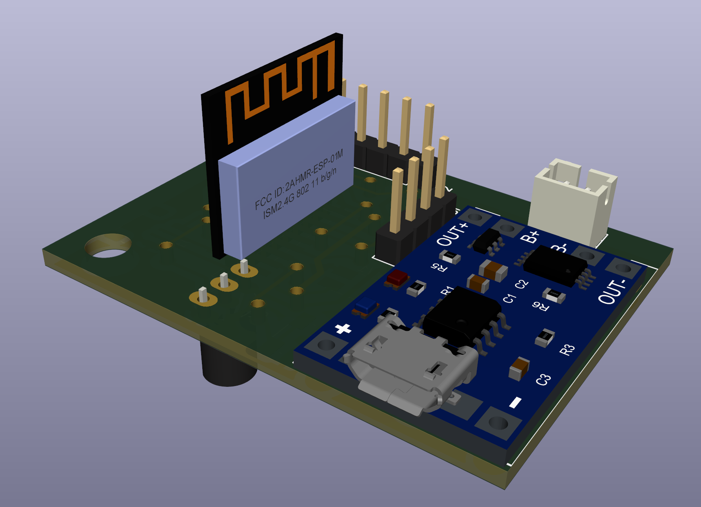
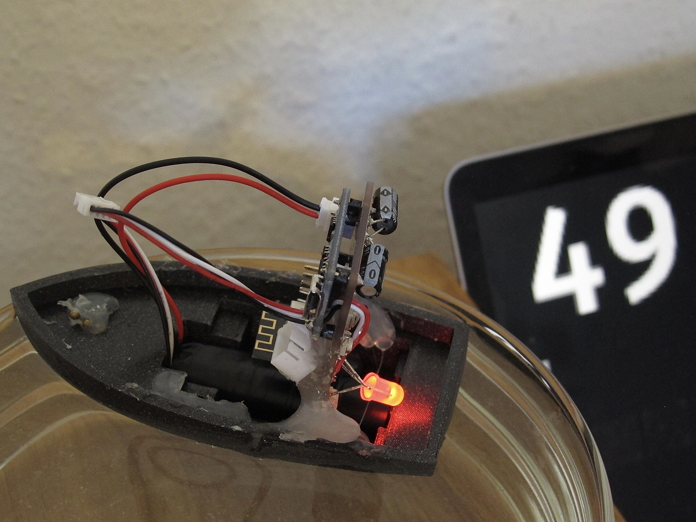

Bath tub boat
==============

Measure the temperature of your bath tub.
Video: https://vimeo.com/909430078

## Version 2

Pinout:

| Pin | Function             |
|----:|:---------------------|
|   0 | Boot mode / Switch 0 |
|   2 | Switch A             |
|   4 | Temp                 |
|   5 | I2C SCL              |
|  10 | I2C SDA              |
|   9 | Neopixel             |
|  14 | SPI CLK              |
|  15 | SPI CS               |
|  13 | SPI MOSI             |
|  12 | SPI MISO             |
| ADC | Light sensor         |

## Version 1

